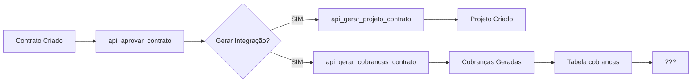

# 📊 AUDITORIA COMPLETA - MÓDULOS FINANCEIRO E CRONOGRAMA

**Data:** 2025-11-25
**Sistema:** WG CRM
**Objetivo:** Identificar gaps e propor soluções para fluxo completo Contrato → Financeiro → Cronograma

---

## 📋 ÍNDICE

1. [Estrutura Atual - Financeiro](#estrutura-atual---financeiro)
2. [Estrutura Atual - Cronograma](#estrutura-atual---cronograma)
3. [Fluxo Atual: Contrato → Financeiro](#fluxo-atual-contrato--financeiro)
4. [GAPS Identificados](#gaps-identificados)
5. [Soluções Propostas](#soluções-propostas)
6. [Migrations Necessárias](#migrations-necessárias)
7. [Funções SQL a Criar](#funções-sql-a-criar)
8. [Componentes Frontend a Criar/Ajustar](#componentes-frontend-a-criarajustar)
9. [Roadmap de Implementação](#roadmap-de-implementação)

---

## 📊 ESTRUTURA ATUAL - FINANCEIRO

### Tabelas Existentes

#### ✅ ESTRUTURA ANTIGA (002_criar_tabelas_financeiro.sql)
```sql
titulos_financeiros
├── id (uuid)
├── empresa_id (uuid → empresas)
├── tipo ('Pagar' | 'Receber')
├── descricao (text)
├── valor (numeric)
├── data_emissao (date)
├── data_vencimento (date)
├── status ('Previsto' | 'Aprovado' | 'Pago' | 'Cancelado' | 'Vencido')
├── categoria_id (uuid → plano_contas)
├── centro_custo_id (uuid → centros_custo)
├── conta_financeira_id (uuid → contas_financeiras)
├── observacao (text)
├── documento (text)
└── fornecedor_cliente (text)

lancamentos
├── id (uuid)
├── titulo_id (uuid → titulos_financeiros)
├── valor (numeric)
├── data (date)
├── tipo_pagamento (text)
├── centro_custo_cliente_id (uuid → centros_custo)
├── categoria_id (uuid → plano_contas)
├── observacao (text)
└── created_at (timestamptz)

plano_contas
├── id (uuid)
├── grupo ('Receitas' | 'Despesas')
├── conta (text)
├── codigo (text unique)
├── tipo (text)
├── descricao (text)
└── ativo (boolean)

centros_custo
├── id (uuid)
├── nome (text)
├── codigo (text unique)
├── descricao (text)
└── ativo (boolean)

contas_financeiras
├── id (uuid)
├── empresa_id (uuid → empresas)
├── banco (text)
├── agencia (text)
├── conta (text)
├── tipo ('corrente' | 'poupanca' | 'investimento')
├── saldo_inicial (numeric)
├── saldo_atual (numeric)
└── ativo (boolean)
```

#### ✅ ESTRUTURA NOVA (20251126120000_finance_core.sql)
```sql
fin_categories
├── id (uuid)
├── empresa_id (uuid → empresas)
├── name (text)
├── kind ('income' | 'expense')
└── created_at (timestamptz)

fin_transactions
├── id (uuid)
├── cliente_id (uuid → entities)
├── category_id (uuid → fin_categories)
├── description (text)
├── amount (numeric)
├── occurred_at (date)
├── type ('income' | 'expense')
├── status (text)
└── created_at (timestamptz)

solicitacoes_pagamento
├── id (uuid)
├── cliente_id (uuid → entities)
├── categoria_id (uuid → fin_categories)
├── descricao (text)
├── valor (numeric)
├── vencimento (date)
├── status ('Pendente' | 'Aprovada' | 'Paga' | 'Cancelada')
└── created_at (timestamptz)

comissoes
├── id (uuid)
├── contrato_id (uuid → project_contracts)
├── responsavel_id (uuid → entities)
├── percentual (numeric)
├── valor (numeric)
├── status ('Previsto' | 'Aprovado' | 'Pago' | 'Cancelado')
└── created_at (timestamptz)

reembolsos
├── id (uuid)
├── destinatario_id (uuid → entities)
├── destinatario_tipo ('empresa' | 'colaborador')
├── categoria_id (uuid → fin_categories)
├── descricao (text)
├── valor (numeric)
├── data (date)
├── status ('Pendente' | 'Aprovado' | 'Pago' | 'Cancelado')
└── created_at (timestamptz)

cobrancas ⭐ (PRINCIPAL PARA INTEGRAÇÃO)
├── id (uuid)
├── cliente_id (uuid → entities)
├── project_id (uuid → projects)
├── descricao (text)
├── valor (numeric)
├── vencimento (date)
├── status ('Pendente' | 'EmAberto' | 'Pago' | 'Cancelado')
└── created_at (timestamptz)
```

### Funções SQL Existentes

#### ✅ Funções de Relatórios (021_criar_funcoes_finance.sql)
- `finance_report()` - Relatório financeiro com filtros
- `fn_cashflow_daily()` - Fluxo de caixa diário
- `fn_dre()` - DRE (Demonstrativo de Resultado)
- `get_finance_dashboard_data()` - Dados para dashboard
- `fin_txn_duplicate()` - Duplicar transação
- `fin_txn_soft_delete()` - Cancelar título
- `fin_card_soft_delete()` - Desativar conta
- **Triggers:**
  - `trigger_fin_txn_compute_amount()` - Validar valores
  - `trigger_fin_txn_defaults()` - Preencher padrões

#### ✅ Funções de Integração (20251126151000_funcoes_aprovacao_contratos.sql)
- `api_gerar_cobrancas_contrato(p_contrato_id)` - Gera cobranças a partir de contrato
- `api_gerar_projeto_contrato(p_contrato_id)` - Gera projeto a partir de contrato
- `api_aprovar_contrato(p_contrato_id, p_gerar_integracao)` - Aprova e integra tudo
- `api_rejeitar_contrato(p_contrato_id, p_motivo)` - Rejeita contrato

---

## 🏗️ ESTRUTURA ATUAL - CRONOGRAMA

### Tabelas Existentes

```sql
projects ⭐ (PRINCIPAL)
├── id (uuid)
├── obra_id (uuid → obras)
├── empresa_id (uuid)
├── codigo (varchar unique)
├── titulo (text)
├── descricao (text)
├── data_inicio (date)
├── data_fim_prevista (date)
├── data_fim_real (date)
├── status ('planejamento' | 'em_andamento' | 'pausado' | 'concluido' | 'cancelado')
├── progresso_percentual (numeric 0-100)
├── orcamento_total (numeric)
├── custo_realizado (numeric)
├── responsavel_id (uuid → profiles)
├── created_at (timestamptz)
├── updated_at (timestamptz)
└── created_by (uuid → profiles)

tasks
├── id (uuid)
├── project_id (uuid → projects)
├── titulo (text)
├── descricao (text)
├── status (text)
├── responsavel_id (uuid → profiles)
├── prazo (date)
├── criado_em (timestamptz)
└── atualizado_em (timestamptz)

project_items
├── id (uuid)
├── project_id (uuid → projects)
├── catalog_item_id (uuid)
├── quantidade (numeric)
├── preco_unitario (numeric)
└── created_at (timestamptz)

teams
├── id (uuid)
├── empresa_id (uuid)
├── nome (text)
├── descricao (text)
└── created_at (timestamptz)

team_members
├── id (uuid)
├── team_id (uuid → teams)
├── user_id (uuid → profiles)
├── papel (text)
└── created_at (timestamptz)

project_contracts ⭐ (PONTE ENTRE CONTRATOS E PROJETOS)
├── id (uuid)
├── project_id (uuid → projects)
├── cliente_id (uuid → entities)
├── numero (text)
├── descricao (text)
├── valor_total (numeric)
├── status (text)
├── aprovado (boolean)
├── aprovado_por (uuid → profiles)
├── aprovado_em (timestamptz)
├── motivo_rejeicao (text)
├── condicoes_pagamento (jsonb)
├── forma_pagamento (text)
├── parcelas (integer)
├── cronograma_gerado (boolean)
├── financeiro_gerado (boolean)
├── conteudo_contrato (text)
└── created_at (timestamptz)

project_comments
├── id (uuid)
├── project_id (uuid → projects)
├── author_id (uuid → profiles)
├── content (text)
└── created_at (timestamptz)
```

---

## 🔄 FLUXO ATUAL: CONTRATO → FINANCEIRO

### Como Funciona Hoje



### Pontos de Integração Atuais

1. **Contrato Aprovado** → `api_aprovar_contrato()`
   - ✅ Atualiza `project_contracts.aprovado = TRUE`
   - ✅ Chama `api_gerar_projeto_contrato()` → cria em `projects`
   - ✅ Chama `api_gerar_cobrancas_contrato()` → cria em `cobrancas`

2. **Cobranças Geradas** → Tabela `cobrancas`
   - ✅ Criadas com base em `project_contracts.condicoes_pagamento` (JSONB)
   - ✅ Relacionadas com `cliente_id` e `project_id`
   - ✅ Status: 'Pendente' | 'EmAberto' | 'Pago' | 'Cancelado'

3. **Frontend Cobrancas** → `src/modules/financeiro/pages/Cobrancas.jsx`
   - ✅ Lista cobranças da tabela `cobrancas`
   - ✅ Permite criar novas manualmente
   - ❌ **NÃO integra com contratos automaticamente**
   - ❌ **NÃO tem avisos de vencimento**
   - ❌ **NÃO lança em `lancamentos` ou `titulos_financeiros`**

---

## ❌ GAPS IDENTIFICADOS

### 🔴 CRÍTICOS (Impedem funcionamento completo)

#### 1. **Falta de Integração: Cobranças → Lançamentos**
**Problema:** Cobranças são criadas mas não geram lançamentos financeiros automáticos
**Impacto:** Dados financeiros (fluxo de caixa, DRE) não refletem as cobranças
**Solução:** Criar trigger ou função para gerar `lancamentos` quando cobrança é paga

#### 2. **Sistema de Avisos de Pagamento Inexistente**
**Problema:** Não há notificações de vencimento (5 dias antes, 1 dia antes)
**Impacto:** Cliente pode perder prazos de pagamento
**Solução:** Criar tabela `alertas_pagamento` + função SQL + componente React

#### 3. **Centro de Custo Não Vinculado ao Cliente**
**Problema:** `cobrancas` não tem `centro_custo_id`, só `cliente_id`
**Impacto:** Impossível rastrear custos por núcleo (arquitetura, engenharia, marcenaria)
**Solução:** Adicionar `centro_custo_id` em `cobrancas` + lógica automática baseada em cliente

#### 4. **Falta de Vínculo: Cliente → Centro de Custo → Núcleo**
**Problema:** Tabela `entities` não tem campo para núcleo/centro de custo padrão
**Impacto:** Impossível determinar automaticamente o núcleo de um cliente
**Solução:** Adicionar `centro_custo_padrao_id` em `entities`

#### 5. **Lançamento de Receitas Previstas Inexistente**
**Problema:** Cobranças não geram receitas previstas em `titulos_financeiros`
**Impacto:** Planejamento financeiro incompleto
**Solução:** Função para converter cobranças em títulos (tipo Receber, status Previsto)

### 🟡 IMPORTANTES (Limitam funcionalidades)

#### 6. **Falta de Funções PDF/Compartilhar/Editar/Excluir em Todos Módulos**
**Problema:** Funcionalidades básicas de CRUD não estão completas
**Impacto:** Usuário não consegue exportar, compartilhar ou gerenciar dados
**Solução:** Criar componentes reutilizáveis + funções SQL

#### 7. **Cronograma: Sistema de Montagem de Equipe Incompleto**
**Problema:** Não há interface de 2 colunas para selecionar colaboradores/fornecedores
**Impacto:** Difícil montar equipes de projeto
**Solução:** Criar componente `TeamBuilder` com listagem + seleção

#### 8. **Gráfico de Gantt: Comentários e Edição Inline Faltam**
**Problema:** Não há Gantt interativo com edição e comentários
**Impacto:** Gerenciamento de cronograma limitado
**Solução:** Implementar biblioteca Gantt (Frappe, DHTMLX, ou custom)

#### 9. **Estrutura Duplicada: 2 Sistemas Financeiros Paralelos**
**Problema:** Estrutura antiga (`titulos_financeiros`) e nova (`cobrancas`, `fin_transactions`) coexistem
**Impacto:** Confusão, dados duplicados, complexidade
**Solução:** **Decidir:** Migrar tudo para estrutura nova OU usar estrutura antiga como base

### 🟢 MELHORIAS (Otimizações)

#### 10. **Relatórios Financeiros Não Contemplam Cobranças**
**Problema:** Funções como `fn_dre()`, `fn_cashflow_daily()` só olham `titulos_financeiros`
**Impacto:** Relatórios incompletos
**Solução:** Atualizar funções para incluir dados de `cobrancas` e `fin_transactions`

#### 11. **Falta de Testes Automatizados**
**Problema:** Não há testes SQL ou Jest/Vitest
**Impacto:** Alto risco de regressões
**Solução:** Criar arquivos `.test.sql` e testes de integração React

---

## ✅ SOLUÇÕES PROPOSTAS

### Estratégia Geral

**OPÇÃO RECOMENDADA:** Consolidar em ESTRUTURA ÚNICA

**Decisão:**
- **Usar `cobrancas` como fonte de verdade** (já integrada com contratos)
- **Manter `titulos_financeiros`** para outros tipos de títulos (fornecedores, despesas)
- **Sincronizar:** Cobranças pagas → gerar título tipo Receber
- **Lançamentos:** Usar `lancamentos` como histórico de pagamentos

### Arquitetura Proposta

```
┌─────────────────────────────────────────────────────────┐
│                    project_contracts                     │
│  (Contrato aprovado com condicoes_pagamento JSONB)      │
└──────────────────┬──────────────────────────────────────┘
                   │
                   ↓ api_gerar_cobrancas_contrato()
┌─────────────────────────────────────────────────────────┐
│                       cobrancas                          │
│  - cliente_id, project_id, valor, vencimento, status    │
│  - centro_custo_id (NOVO)                                │
│  - categoria_id (NOVO)                                   │
└──────────────────┬──────────────────────────────────────┘
                   │
                   ↓ ON INSERT/UPDATE
┌─────────────────────────────────────────────────────────┐
│                 titulos_financeiros                      │
│  - Tipo: 'Receber'                                       │
│  - Status: 'Previsto' → 'Pago' quando cobrança paga     │
│  - Centro de custo vinculado                             │
└──────────────────┬──────────────────────────────────────┘
                   │
                   ↓ ON UPDATE status='Pago'
┌─────────────────────────────────────────────────────────┐
│                     lancamentos                          │
│  - titulo_id, valor, data, centro_custo_cliente_id       │
└─────────────────────────────────────────────────────────┘
                   │
                   ↓
┌─────────────────────────────────────────────────────────┐
│            Relatórios / Dashboards / DRE                 │
│  - finance_report(), fn_dre(), fn_cashflow_daily()       │
└─────────────────────────────────────────────────────────┘
```

### Fluxo Ponta a Ponta

```
1. CONTRATO APROVADO
   ↓
2. api_aprovar_contrato() → gera cobranças em `cobrancas`
   ↓
3. Trigger auto_sync_cobrancas_titulos → cria título em `titulos_financeiros` (status Previsto)
   ↓
4. Sistema de alertas verifica vencimentos
   ├── 5 dias antes → notifica (email/popup)
   └── 1 dia antes → notifica (email/popup)
   ↓
5. Usuário marca cobrança como PAGA
   ↓
6. Trigger auto_lancar_cobranca_paga → atualiza título para status Pago + cria lançamento em `lancamentos`
   ↓
7. Relatórios DRE, Fluxo de Caixa refletem automaticamente
```

---

## 🗃️ MIGRATIONS NECESSÁRIAS

### Migration 1: Adicionar Campos em `cobrancas`

**Arquivo:** `supabase/supabase/migrations/20251126160000_cobrancas_centro_custo.sql`

```sql
-- =============================================
-- Migration: Adicionar centro_custo_id e categoria_id em cobrancas
-- Data: 2025-11-26
-- =============================================

BEGIN;

-- Adicionar colunas
ALTER TABLE public.cobrancas
  ADD COLUMN IF NOT EXISTS centro_custo_id UUID REFERENCES centros_custo(id) ON DELETE SET NULL,
  ADD COLUMN IF NOT EXISTS categoria_id UUID REFERENCES plano_contas(id) ON DELETE SET NULL,
  ADD COLUMN IF NOT EXISTS titulo_financeiro_id UUID REFERENCES titulos_financeiros(id) ON DELETE SET NULL,
  ADD COLUMN IF NOT EXISTS observacoes TEXT;

-- Índices
CREATE INDEX IF NOT EXISTS idx_cobrancas_centro_custo ON cobrancas(centro_custo_id);
CREATE INDEX IF NOT EXISTS idx_cobrancas_categoria ON cobrancas(categoria_id);
CREATE INDEX IF NOT EXISTS idx_cobrancas_titulo ON cobrancas(titulo_financeiro_id);

COMMENT ON COLUMN cobrancas.centro_custo_id IS 'Centro de custo da cobrança (núcleo: arquitetura, engenharia, marcenaria)';
COMMENT ON COLUMN cobrancas.categoria_id IS 'Categoria contábil da cobrança (plano de contas)';
COMMENT ON COLUMN cobrancas.titulo_financeiro_id IS 'Vínculo com título financeiro gerado automaticamente';

COMMIT;
```

### Migration 2: Adicionar Centro de Custo Padrão em `entities`

**Arquivo:** `supabase/supabase/migrations/20251126160100_entities_centro_custo_padrao.sql`

```sql
-- =============================================
-- Migration: Adicionar centro de custo padrão em entities
-- Data: 2025-11-26
-- =============================================

BEGIN;

ALTER TABLE public.entities
  ADD COLUMN IF NOT EXISTS centro_custo_padrao_id UUID REFERENCES centros_custo(id) ON DELETE SET NULL,
  ADD COLUMN IF NOT EXISTS nucleo TEXT CHECK (nucleo IN ('arquitetura', 'engenharia', 'marcenaria'));

CREATE INDEX IF NOT EXISTS idx_entities_centro_custo ON entities(centro_custo_padrao_id);
CREATE INDEX IF NOT EXISTS idx_entities_nucleo ON entities(nucleo);

COMMENT ON COLUMN entities.centro_custo_padrao_id IS 'Centro de custo padrão para lançamentos relacionados a esta entidade';
COMMENT ON COLUMN entities.nucleo IS 'Núcleo de atuação do cliente (arquitetura, engenharia, marcenaria)';

-- Popular núcleo baseado em centro de custo existente
UPDATE entities e
SET nucleo = CASE
  WHEN cc.nome ILIKE '%arquitetura%' THEN 'arquitetura'
  WHEN cc.nome ILIKE '%engenharia%' THEN 'engenharia'
  WHEN cc.nome ILIKE '%marcenaria%' THEN 'marcenaria'
  ELSE NULL
END
FROM centros_custo cc
WHERE e.centro_custo_padrao_id = cc.id;

COMMIT;
```

### Migration 3: Tabela de Alertas de Pagamento

**Arquivo:** `supabase/supabase/migrations/20251126160200_alertas_pagamento.sql`

```sql
-- =============================================
-- Migration: Criar tabela de alertas de pagamento
-- Data: 2025-11-26
-- =============================================

BEGIN;

CREATE TABLE IF NOT EXISTS public.alertas_pagamento (
  id UUID PRIMARY KEY DEFAULT gen_random_uuid(),
  cobranca_id UUID REFERENCES cobrancas(id) ON DELETE CASCADE,
  tipo_alerta TEXT NOT NULL CHECK (tipo_alerta IN ('5_dias_antes', '1_dia_antes', 'vencido')),
  data_alerta DATE NOT NULL,
  data_vencimento DATE NOT NULL,
  status TEXT DEFAULT 'pendente' CHECK (status IN ('pendente', 'enviado', 'lido', 'ignorado')),
  metodo_envio TEXT[] DEFAULT ARRAY['popup'], -- ['popup', 'email', 'sms']
  enviado_em TIMESTAMPTZ,
  lido_em TIMESTAMPTZ,
  created_at TIMESTAMPTZ DEFAULT NOW()
);

CREATE INDEX IF NOT EXISTS idx_alertas_cobranca ON alertas_pagamento(cobranca_id);
CREATE INDEX IF NOT EXISTS idx_alertas_data ON alertas_pagamento(data_alerta);
CREATE INDEX IF NOT EXISTS idx_alertas_status ON alertas_pagamento(status);

COMMENT ON TABLE alertas_pagamento IS 'Alertas de vencimento de cobranças (5 dias antes, 1 dia antes)';

COMMIT;
```

### Migration 4: Campos Adicionais em `tasks` (Gráfico de Gantt)

**Arquivo:** `supabase/supabase/migrations/20251126160300_tasks_gantt_fields.sql`

```sql
-- =============================================
-- Migration: Adicionar campos para Gráfico de Gantt em tasks
-- Data: 2025-11-26
-- =============================================

BEGIN;

ALTER TABLE public.tasks
  ADD COLUMN IF NOT EXISTS data_inicio DATE,
  ADD COLUMN IF NOT EXISTS data_fim DATE,
  ADD COLUMN IF NOT EXISTS duracao_dias INTEGER GENERATED ALWAYS AS (
    CASE
      WHEN data_inicio IS NOT NULL AND data_fim IS NOT NULL
      THEN (data_fim - data_inicio)
      ELSE NULL
    END
  ) STORED,
  ADD COLUMN IF NOT EXISTS progresso_percentual NUMERIC(5,2) DEFAULT 0 CHECK (progresso_percentual BETWEEN 0 AND 100),
  ADD COLUMN IF NOT EXISTS categoria TEXT, -- Ex: 'Fundação', 'Estrutura', 'Acabamento'
  ADD COLUMN IF NOT EXISTS cor_categoria VARCHAR(7), -- Hex color: #FF5733
  ADD COLUMN IF NOT EXISTS dependencias UUID[], -- Array de IDs de tarefas predecessoras
  ADD COLUMN IF NOT EXISTS ordem_exibicao INTEGER DEFAULT 0;

CREATE INDEX IF NOT EXISTS idx_tasks_data_inicio ON tasks(data_inicio);
CREATE INDEX IF NOT EXISTS idx_tasks_data_fim ON tasks(data_fim);
CREATE INDEX IF NOT EXISTS idx_tasks_categoria ON tasks(categoria);

COMMENT ON COLUMN tasks.categoria IS 'Categoria da tarefa para agrupamento no Gantt (ex: Fundação, Estrutura)';
COMMENT ON COLUMN tasks.cor_categoria IS 'Cor da categoria no gráfico de Gantt (hex)';
COMMENT ON COLUMN tasks.dependencias IS 'Array de UUIDs de tarefas que devem ser concluídas antes desta';

COMMIT;
```

### Migration 5: Tabela de Comentários em Tarefas (Timeline Gantt)

**Arquivo:** `supabase/supabase/migrations/20251126160400_task_comments.sql`

```sql
-- =============================================
-- Migration: Criar tabela de comentários em tarefas (Timeline Gantt)
-- Data: 2025-11-26
-- =============================================

BEGIN;

CREATE TABLE IF NOT EXISTS public.task_comments (
  id UUID PRIMARY KEY DEFAULT gen_random_uuid(),
  task_id UUID REFERENCES tasks(id) ON DELETE CASCADE,
  project_id UUID REFERENCES projects(id) ON DELETE CASCADE,
  author_id UUID REFERENCES profiles(id),
  data_comentario DATE NOT NULL, -- Dia específico na timeline
  conteudo TEXT NOT NULL,
  tipo TEXT DEFAULT 'comentario' CHECK (tipo IN ('comentario', 'alteracao', 'alerta')),
  created_at TIMESTAMPTZ DEFAULT NOW(),
  updated_at TIMESTAMPTZ DEFAULT NOW()
);

CREATE INDEX IF NOT EXISTS idx_task_comments_task ON task_comments(task_id);
CREATE INDEX IF NOT EXISTS idx_task_comments_project ON task_comments(project_id);
CREATE INDEX IF NOT EXISTS idx_task_comments_data ON task_comments(data_comentario);

COMMENT ON TABLE task_comments IS 'Comentários vinculados a dias específicos na timeline do Gantt';

COMMIT;
```

---

## 🛠️ FUNÇÕES SQL A CRIAR

### Função 1: Sincronizar Cobrança → Título Financeiro

**Arquivo:** `supabase/supabase/migrations/20251126170000_func_sync_cobranca_titulo.sql`

```sql
-- =============================================
-- Função: Sincronizar cobrança com título financeiro
-- =============================================

CREATE OR REPLACE FUNCTION api_sync_cobranca_titulo(p_cobranca_id UUID)
RETURNS UUID
LANGUAGE plpgsql
SECURITY DEFINER
SET search_path = public
AS $$
DECLARE
  v_cobranca RECORD;
  v_titulo_id UUID;
  v_centro_custo_id UUID;
  v_categoria_id UUID;
BEGIN
  -- Buscar cobrança
  SELECT * INTO v_cobranca FROM cobrancas WHERE id = p_cobranca_id;
  IF NOT FOUND THEN
    RAISE EXCEPTION 'Cobrança não encontrada: %', p_cobranca_id;
  END IF;

  -- Determinar centro de custo (da cobrança ou do cliente)
  IF v_cobranca.centro_custo_id IS NOT NULL THEN
    v_centro_custo_id := v_cobranca.centro_custo_id;
  ELSE
    -- Buscar centro de custo padrão do cliente
    SELECT centro_custo_padrao_id INTO v_centro_custo_id
    FROM entities
    WHERE id = v_cobranca.cliente_id;
  END IF;

  -- Determinar categoria (padrão: Honorários de Projeto)
  IF v_cobranca.categoria_id IS NOT NULL THEN
    v_categoria_id := v_cobranca.categoria_id;
  ELSE
    SELECT id INTO v_categoria_id
    FROM plano_contas
    WHERE codigo = 'R001' -- Honorários de Projeto
    LIMIT 1;
  END IF;

  -- Verificar se título já existe
  IF v_cobranca.titulo_financeiro_id IS NOT NULL THEN
    -- Atualizar título existente
    UPDATE titulos_financeiros
    SET
      valor = v_cobranca.valor,
      data_vencimento = v_cobranca.vencimento,
      status = CASE v_cobranca.status
        WHEN 'Pago' THEN 'Pago'
        WHEN 'Cancelado' THEN 'Cancelado'
        WHEN 'EmAberto' THEN 'Aprovado'
        ELSE 'Previsto'
      END,
      centro_custo_id = v_centro_custo_id,
      categoria_id = v_categoria_id,
      updated_at = NOW()
    WHERE id = v_cobranca.titulo_financeiro_id;

    RETURN v_cobranca.titulo_financeiro_id;
  ELSE
    -- Criar novo título
    INSERT INTO titulos_financeiros (
      empresa_id,
      tipo,
      descricao,
      valor,
      data_emissao,
      data_vencimento,
      status,
      categoria_id,
      centro_custo_id,
      fornecedor_cliente,
      observacao
    ) VALUES (
      (SELECT empresa_id FROM profiles WHERE id = auth.uid()),
      'Receber',
      COALESCE(v_cobranca.descricao, 'Cobrança - Projeto'),
      v_cobranca.valor,
      CURRENT_DATE,
      v_cobranca.vencimento,
      CASE v_cobranca.status
        WHEN 'Pago' THEN 'Pago'
        WHEN 'Cancelado' THEN 'Cancelado'
        WHEN 'EmAberto' THEN 'Aprovado'
        ELSE 'Previsto'
      END,
      v_categoria_id,
      v_centro_custo_id,
      (SELECT nome_razao_social FROM entities WHERE id = v_cobranca.cliente_id),
      'Gerado automaticamente a partir de cobrança'
    )
    RETURNING id INTO v_titulo_id;

    -- Atualizar cobrança com vínculo
    UPDATE cobrancas
    SET titulo_financeiro_id = v_titulo_id
    WHERE id = p_cobranca_id;

    RETURN v_titulo_id;
  END IF;
END;
$$;

COMMENT ON FUNCTION api_sync_cobranca_titulo IS 'Sincroniza cobrança com título financeiro (cria ou atualiza)';
```

### Função 2: Lançar Cobrança Paga

**Arquivo:** `supabase/supabase/migrations/20251126170100_func_lancar_cobranca_paga.sql`

```sql
-- =============================================
-- Função: Lançar cobrança paga em lançamentos
-- =============================================

CREATE OR REPLACE FUNCTION api_lancar_cobranca_paga(p_cobranca_id UUID, p_data_pagamento DATE DEFAULT CURRENT_DATE)
RETURNS UUID
LANGUAGE plpgsql
SECURITY DEFINER
SET search_path = public
AS $$
DECLARE
  v_cobranca RECORD;
  v_lancamento_id UUID;
BEGIN
  -- Buscar cobrança
  SELECT * INTO v_cobranca FROM cobrancas WHERE id = p_cobranca_id;
  IF NOT FOUND THEN
    RAISE EXCEPTION 'Cobrança não encontrada: %', p_cobranca_id;
  END IF;

  -- Validar status
  IF v_cobranca.status != 'Pago' THEN
    RAISE EXCEPTION 'Cobrança deve estar com status Pago para gerar lançamento';
  END IF;

  -- Sincronizar título primeiro
  PERFORM api_sync_cobranca_titulo(p_cobranca_id);

  -- Criar lançamento
  INSERT INTO lancamentos (
    titulo_id,
    valor,
    data,
    centro_custo_cliente_id,
    categoria_id,
    observacao
  ) VALUES (
    v_cobranca.titulo_financeiro_id,
    v_cobranca.valor,
    p_data_pagamento,
    v_cobranca.centro_custo_id,
    v_cobranca.categoria_id,
    'Pagamento de cobrança - ' || COALESCE(v_cobranca.descricao, 'Sem descrição')
  )
  RETURNING id INTO v_lancamento_id;

  RAISE NOTICE 'Lançamento criado: %', v_lancamento_id;
  RETURN v_lancamento_id;
END;
$$;

COMMENT ON FUNCTION api_lancar_cobranca_paga IS 'Cria lançamento financeiro quando cobrança é marcada como paga';
```

### Função 3: Gerar Alertas de Pagamento

**Arquivo:** `supabase/supabase/migrations/20251126170200_func_gerar_alertas_pagamento.sql`

```sql
-- =============================================
-- Função: Gerar alertas de pagamento
-- =============================================

CREATE OR REPLACE FUNCTION api_gerar_alertas_pagamento()
RETURNS TABLE(alertas_criados INTEGER, alertas_atualizados INTEGER)
LANGUAGE plpgsql
SECURITY DEFINER
SET search_path = public
AS $$
DECLARE
  v_cobranca RECORD;
  v_alertas_criados INTEGER := 0;
  v_alertas_atualizados INTEGER := 0;
  v_data_5_dias DATE;
  v_data_1_dia DATE;
BEGIN
  -- Para cada cobrança pendente ou em aberto
  FOR v_cobranca IN
    SELECT * FROM cobrancas
    WHERE status IN ('Pendente', 'EmAberto')
    AND vencimento >= CURRENT_DATE - INTERVAL '5 days' -- Só alertas nos últimos 5 dias ou futuro
  LOOP
    v_data_5_dias := v_cobranca.vencimento - INTERVAL '5 days';
    v_data_1_dia := v_cobranca.vencimento - INTERVAL '1 day';

    -- Alerta de 5 dias antes
    IF CURRENT_DATE = v_data_5_dias THEN
      INSERT INTO alertas_pagamento (
        cobranca_id,
        tipo_alerta,
        data_alerta,
        data_vencimento,
        metodo_envio
      ) VALUES (
        v_cobranca.id,
        '5_dias_antes',
        CURRENT_DATE,
        v_cobranca.vencimento,
        ARRAY['popup', 'email']
      )
      ON CONFLICT DO NOTHING;
      v_alertas_criados := v_alertas_criados + 1;
    END IF;

    -- Alerta de 1 dia antes
    IF CURRENT_DATE = v_data_1_dia THEN
      INSERT INTO alertas_pagamento (
        cobranca_id,
        tipo_alerta,
        data_alerta,
        data_vencimento,
        metodo_envio
      ) VALUES (
        v_cobranca.id,
        '1_dia_antes',
        CURRENT_DATE,
        v_cobranca.vencimento,
        ARRAY['popup', 'email']
      )
      ON CONFLICT DO NOTHING;
      v_alertas_criados := v_alertas_criados + 1;
    END IF;

    -- Alerta de vencido
    IF CURRENT_DATE > v_cobranca.vencimento THEN
      INSERT INTO alertas_pagamento (
        cobranca_id,
        tipo_alerta,
        data_alerta,
        data_vencimento,
        metodo_envio
      ) VALUES (
        v_cobranca.id,
        'vencido',
        CURRENT_DATE,
        v_cobranca.vencimento,
        ARRAY['popup', 'email']
      )
      ON CONFLICT DO NOTHING;
      v_alertas_criados := v_alertas_criados + 1;
    END IF;
  END LOOP;

  RETURN QUERY SELECT v_alertas_criados, v_alertas_atualizados;
END;
$$;

COMMENT ON FUNCTION api_gerar_alertas_pagamento IS 'Gera alertas de vencimento (5 dias antes, 1 dia antes, vencido)';
```

### Função 4: Obter Alertas Pendentes

**Arquivo:** `supabase/supabase/migrations/20251126170300_func_get_alertas_pendentes.sql`

```sql
-- =============================================
-- Função: Obter alertas pendentes do usuário
-- =============================================

CREATE OR REPLACE FUNCTION api_get_alertas_pendentes(p_user_id UUID DEFAULT NULL)
RETURNS TABLE(
  alerta_id UUID,
  cobranca_id UUID,
  tipo_alerta TEXT,
  data_alerta DATE,
  data_vencimento DATE,
  cliente_nome TEXT,
  valor NUMERIC,
  descricao TEXT,
  dias_para_vencimento INTEGER
)
LANGUAGE plpgsql
SECURITY DEFINER
SET search_path = public
AS $$
BEGIN
  RETURN QUERY
  SELECT
    a.id AS alerta_id,
    a.cobranca_id,
    a.tipo_alerta,
    a.data_alerta,
    a.data_vencimento,
    e.nome_razao_social AS cliente_nome,
    c.valor,
    c.descricao,
    (c.vencimento - CURRENT_DATE)::INTEGER AS dias_para_vencimento
  FROM alertas_pagamento a
  INNER JOIN cobrancas c ON c.id = a.cobranca_id
  LEFT JOIN entities e ON e.id = c.cliente_id
  WHERE a.status = 'pendente'
  AND (p_user_id IS NULL OR EXISTS (
    SELECT 1 FROM profiles p
    WHERE p.id = p_user_id
    AND p.empresa_id = (SELECT empresa_id FROM profiles WHERE id = auth.uid())
  ))
  ORDER BY c.vencimento ASC, a.tipo_alerta ASC;
END;
$$;

COMMENT ON FUNCTION api_get_alertas_pendentes IS 'Retorna alertas de pagamento pendentes para o usuário';
```

### Função 5: Atualizar Funções de Relatório para Incluir Cobranças

**Arquivo:** `supabase/supabase/migrations/20251126170400_update_relatorios_com_cobrancas.sql`

```sql
-- =============================================
-- Atualizar funções de relatório para incluir cobranças
-- =============================================

-- Atualizar fn_dre para incluir cobranças pagas
CREATE OR REPLACE FUNCTION fn_dre_v2(
    p_org uuid DEFAULT NULL,
    p_d1 date DEFAULT date_trunc('month', CURRENT_DATE)::date,
    p_d2 date DEFAULT (date_trunc('month', CURRENT_DATE) + INTERVAL '1 month' - INTERVAL '1 day')::date
)
RETURNS TABLE(
    total_receitas numeric,
    total_despesas numeric,
    resultado numeric,
    margem_lucro numeric,
    qtd_receitas integer,
    qtd_despesas integer,
    ticket_medio_receitas numeric,
    ticket_medio_despesas numeric
)
LANGUAGE plpgsql
SECURITY DEFINER
SET search_path = public
AS $$
DECLARE
    v_receitas numeric;
    v_despesas numeric;
    v_qtd_receitas integer;
    v_qtd_despesas integer;
BEGIN
    -- Receitas: Títulos + Cobranças pagas
    SELECT
        COALESCE(SUM(valor), 0),
        COUNT(*)
    INTO v_receitas, v_qtd_receitas
    FROM (
      -- Títulos a receber pagos
      SELECT valor FROM titulos_financeiros
      WHERE tipo = 'Receber'
        AND status = 'Pago'
        AND data_vencimento BETWEEN p_d1 AND p_d2
        AND (p_org IS NULL OR empresa_id = p_org)

      UNION ALL

      -- Cobranças pagas (que não têm título vinculado)
      SELECT valor FROM cobrancas
      WHERE status = 'Pago'
        AND vencimento BETWEEN p_d1 AND p_d2
        AND titulo_financeiro_id IS NULL
    ) AS receitas;

    -- Despesas (apenas títulos)
    SELECT
        COALESCE(SUM(valor), 0),
        COUNT(*)
    INTO v_despesas, v_qtd_despesas
    FROM titulos_financeiros
    WHERE tipo = 'Pagar'
        AND status = 'Pago'
        AND data_vencimento BETWEEN p_d1 AND p_d2
        AND (p_org IS NULL OR empresa_id = p_org);

    RETURN QUERY
    SELECT
        v_receitas AS total_receitas,
        v_despesas AS total_despesas,
        (v_receitas - v_despesas) AS resultado,
        CASE
            WHEN v_receitas > 0
            THEN ROUND(((v_receitas - v_despesas) / v_receitas * 100)::numeric, 2)
            ELSE 0
        END AS margem_lucro,
        v_qtd_receitas AS qtd_receitas,
        v_qtd_despesas AS qtd_despesas,
        CASE
            WHEN v_qtd_receitas > 0
            THEN ROUND((v_receitas / v_qtd_receitas)::numeric, 2)
            ELSE 0
        END AS ticket_medio_receitas,
        CASE
            WHEN v_qtd_despesas > 0
            THEN ROUND((v_despesas / v_qtd_despesas)::numeric, 2)
            ELSE 0
        END AS ticket_medio_despesas;
END;
$$;

COMMENT ON FUNCTION fn_dre_v2 IS 'DRE v2 - Inclui cobranças pagas além de títulos financeiros';
```

---

## 🎨 COMPONENTES FRONTEND A CRIAR/AJUSTAR

### Componente 1: `AlertasPagamentoPopup.jsx`

**Localização:** `src/modules/financeiro/components/AlertasPagamentoPopup.jsx`

**Funcionalidade:**
- Busca alertas pendentes via `api_get_alertas_pendentes()`
- Exibe popup no canto superior direito
- Botões: "Marcar como lido", "Ver cobrança", "Ignorar"
- Atualiza contadores em tempo real

**Código Base:**
```jsx
import React, { useState, useEffect } from 'react';
import { Bell, X } from 'lucide-react';
import { Button } from '@/components/ui/button';
import { supabase } from '@/lib/customSupabaseClient';
import { useToast } from '@/components/ui/use-toast';

export const AlertasPagamentoPopup = () => {
  const [alertas, setAlertas] = useState([]);
  const [mostrar, setMostrar] = useState(false);
  const { toast } = useToast();

  useEffect(() => {
    fetchAlertas();
    const interval = setInterval(fetchAlertas, 60000); // Atualizar a cada 1min
    return () => clearInterval(interval);
  }, []);

  const fetchAlertas = async () => {
    const { data, error } = await supabase.rpc('api_get_alertas_pendentes');
    if (!error && data) {
      setAlertas(data);
      if (data.length > 0) setMostrar(true);
    }
  };

  const marcarComoLido = async (alertaId) => {
    await supabase
      .from('alertas_pagamento')
      .update({ status: 'lido', lido_em: new Date() })
      .eq('id', alertaId);
    fetchAlertas();
  };

  if (!mostrar || alertas.length === 0) return null;

  return (
    <div className="fixed top-4 right-4 z-50 max-w-sm bg-white shadow-lg rounded-lg border-l-4 border-orange-500 p-4">
      <div className="flex items-start justify-between mb-2">
        <div className="flex items-center gap-2">
          <Bell className="text-orange-500" size={20} />
          <h3 className="font-bold">Alertas de Pagamento</h3>
        </div>
        <Button variant="ghost" size="sm" onClick={() => setMostrar(false)}>
          <X size={16} />
        </Button>
      </div>

      <div className="space-y-2">
        {alertas.slice(0, 3).map((alerta) => (
          <div key={alerta.alerta_id} className="p-2 bg-orange-50 rounded">
            <p className="text-sm font-medium">{alerta.cliente_nome}</p>
            <p className="text-xs text-gray-600">
              {alerta.tipo_alerta === '5_dias_antes' && 'Vence em 5 dias'}
              {alerta.tipo_alerta === '1_dia_antes' && 'Vence amanhã!'}
              {alerta.tipo_alerta === 'vencido' && 'VENCIDO'}
            </p>
            <p className="text-sm font-bold text-orange-600">
              R$ {alerta.valor.toLocaleString('pt-BR')}
            </p>
            <Button size="sm" onClick={() => marcarComoLido(alerta.alerta_id)}>
              Marcar como lido
            </Button>
          </div>
        ))}
      </div>

      {alertas.length > 3 && (
        <p className="text-xs text-gray-500 mt-2">
          +{alertas.length - 3} alertas adicionais
        </p>
      )}
    </div>
  );
};
```

### Componente 2: `TeamBuilder.jsx` (Montagem de Equipe)

**Localização:** `src/modules/cronograma/components/TeamBuilder.jsx`

**Funcionalidade:**
- 2 colunas: Esquerda (todos entities) | Direita (selecionados)
- Campo de busca com filtro
- Avatar + nome
- Botão "+" para mover para direita
- Botão "Salvar Equipe"

**Código Base:**
```jsx
import React, { useState, useEffect } from 'react';
import { Plus, X, Search } from 'lucide-react';
import { Button } from '@/components/ui/button';
import { Input } from '@/components/ui/input';
import { Avatar, AvatarFallback, AvatarImage } from '@/components/ui/avatar';
import { supabase } from '@/lib/customSupabaseClient';

export const TeamBuilder = ({ projectId, onSave }) => {
  const [entities, setEntities] = useState([]);
  const [selected, setSelected] = useState([]);
  const [search, setSearch] = useState('');

  useEffect(() => {
    fetchEntities();
  }, []);

  const fetchEntities = async () => {
    const { data } = await supabase
      .from('entities')
      .select('id, nome_razao_social, avatar_url, tipo')
      .in('tipo', ['colaborador', 'fornecedor'])
      .eq('ativo', true);
    setEntities(data || []);
  };

  const addToTeam = (entity) => {
    setSelected([...selected, entity]);
  };

  const removeFromTeam = (entityId) => {
    setSelected(selected.filter(e => e.id !== entityId));
  };

  const saveTeam = async () => {
    // Criar equipe + membros
    const { data: team } = await supabase
      .from('teams')
      .insert({ nome: `Equipe - Projeto ${projectId}` })
      .select()
      .single();

    await supabase
      .from('team_members')
      .insert(selected.map(e => ({
        team_id: team.id,
        user_id: e.id,
        papel: e.tipo
      })));

    onSave(team);
  };

  const filteredEntities = entities.filter(e =>
    e.nome_razao_social.toLowerCase().includes(search.toLowerCase()) &&
    !selected.find(s => s.id === e.id)
  );

  return (
    <div className="grid grid-cols-2 gap-4 h-[600px]">
      {/* Coluna Esquerda */}
      <div className="border rounded-lg p-4">
        <h3 className="font-bold mb-2">Colaboradores e Fornecedores</h3>
        <Input
          placeholder="Buscar..."
          value={search}
          onChange={(e) => setSearch(e.target.value)}
          className="mb-4"
          icon={<Search size={16} />}
        />
        <div className="space-y-2 overflow-y-auto h-[500px]">
          {filteredEntities.map(entity => (
            <div key={entity.id} className="flex items-center justify-between p-2 hover:bg-gray-50 rounded">
              <div className="flex items-center gap-2">
                <Avatar>
                  <AvatarImage src={entity.avatar_url} />
                  <AvatarFallback>{entity.nome_razao_social[0]}</AvatarFallback>
                </Avatar>
                <span className="text-sm">{entity.nome_razao_social}</span>
              </div>
              <Button size="sm" onClick={() => addToTeam(entity)}>
                <Plus size={16} />
              </Button>
            </div>
          ))}
        </div>
      </div>

      {/* Coluna Direita */}
      <div className="border rounded-lg p-4 bg-blue-50">
        <h3 className="font-bold mb-4">Equipe Selecionada ({selected.length})</h3>
        <div className="space-y-2 overflow-y-auto h-[500px]">
          {selected.map(entity => (
            <div key={entity.id} className="flex items-center justify-between p-2 bg-white rounded">
              <div className="flex items-center gap-2">
                <Avatar>
                  <AvatarImage src={entity.avatar_url} />
                  <AvatarFallback>{entity.nome_razao_social[0]}</AvatarFallback>
                </Avatar>
                <span className="text-sm font-medium">{entity.nome_razao_social}</span>
              </div>
              <Button size="sm" variant="destructive" onClick={() => removeFromTeam(entity.id)}>
                <X size={16} />
              </Button>
            </div>
          ))}
        </div>
        <Button className="w-full mt-4" onClick={saveTeam} disabled={selected.length === 0}>
          Salvar Equipe
        </Button>
      </div>
    </div>
  );
};
```

### Componente 3: Gráfico de Gantt com Comentários

**Biblioteca Recomendada:** `frappe-gantt` ou `dhtmlx-gantt`

**Localização:** `src/modules/cronograma/components/GanttChart.jsx`

**Funcionalidades:**
- Timeline com tarefas
- Edição inline de datas e nome
- Clique em dia → adicionar comentário
- Cores por categoria
- Dependências entre tarefas

---

## 📅 ROADMAP DE IMPLEMENTAÇÃO

### FASE 1: Estrutura Base (Semana 1)
- ✅ Auditoria completa (FEITO)
- [ ] Aplicar Migration 1: `cobrancas` com centro_custo_id
- [ ] Aplicar Migration 2: `entities` com centro_custo_padrao_id
- [ ] Aplicar Migration 3: Tabela `alertas_pagamento`
- [ ] Criar Função 1: `api_sync_cobranca_titulo`
- [ ] Criar Função 2: `api_lancar_cobranca_paga`
- [ ] **TESTE:** Aprovar contrato → verificar cobranças → sincronizar títulos

### FASE 2: Sistema de Alertas (Semana 2)
- [ ] Criar Função 3: `api_gerar_alertas_pagamento`
- [ ] Criar Função 4: `api_get_alertas_pendentes`
- [ ] Criar Trigger para executar `api_gerar_alertas_pagamento` diariamente (via cron ou pg_cron)
- [ ] Criar Componente: `AlertasPagamentoPopup.jsx`
- [ ] Integrar popup no layout principal
- [ ] **TESTE:** Criar cobrança com vencimento próximo → verificar alertas

### FASE 3: Integração Completa Financeiro (Semana 3)
- [ ] Criar Triggers:
  - `ON INSERT/UPDATE cobrancas` → `api_sync_cobranca_titulo`
  - `ON UPDATE cobrancas.status='Pago'` → `api_lancar_cobranca_paga`
- [ ] Atualizar Função 5: `fn_dre_v2`, `fn_cashflow_daily_v2`
- [ ] Ajustar componente `Cobrancas.jsx`:
  - Adicionar seletor de centro de custo
  - Adicionar seletor de categoria
  - Exibir vínculo com título financeiro
- [ ] **TESTE:** Fluxo completo: Contrato → Cobranças → Títulos → Lançamentos → Relatórios

### FASE 4: Cronograma - Equipes (Semana 4)
- [ ] Criar Componente: `TeamBuilder.jsx`
- [ ] Integrar em `ProjectDetail.jsx`
- [ ] Criar funções CRUD para equipes:
  - `api_criar_equipe`
  - `api_adicionar_membro_equipe`
  - `api_remover_membro_equipe`
- [ ] **TESTE:** Criar projeto → montar equipe → salvar → visualizar

### FASE 5: Cronograma - Gráfico de Gantt (Semana 5-6)
- [ ] Aplicar Migration 4: Campos Gantt em `tasks`
- [ ] Aplicar Migration 5: Tabela `task_comments`
- [ ] Instalar biblioteca Gantt: `npm install frappe-gantt`
- [ ] Criar Componente: `GanttChart.jsx`
- [ ] Implementar:
  - Renderização de tarefas
  - Edição inline de datas
  - Sistema de comentários por dia
  - Cores por categoria
  - Dependências entre tarefas
- [ ] **TESTE:** Criar tarefas → visualizar Gantt → editar datas → adicionar comentários

### FASE 6: Funções Globais (Semana 7)
- [ ] Criar funções SQL para PDF:
  - `api_gerar_pdf_cobranca`
  - `api_gerar_pdf_relatorio`
  - `api_gerar_pdf_cronograma`
- [ ] Criar Componente: `PDFExportButton.jsx` (reutilizável)
- [ ] Criar Componente: `ShareButton.jsx` (compartilhamento)
- [ ] Adicionar botões em:
  - Cobranças
  - Relatórios Financeiros
  - Cronograma
  - Equipes
- [ ] **TESTE:** Exportar PDF de cada módulo → compartilhar → verificar

### FASE 7: Testes Automatizados (Semana 8)
- [ ] Criar testes SQL (`.test.sql`) para cada função
- [ ] Criar testes React (Vitest) para componentes principais
- [ ] Criar testes de integração:
  - Fluxo: Contrato → Cobranças → Títulos → Lançamentos
  - Fluxo: Alertas de pagamento
  - Fluxo: Montagem de equipe
- [ ] CI/CD: Integrar testes no pipeline
- [ ] **TESTE:** Executar todos testes → 100% pass

### FASE 8: Documentação e Treinamento (Semana 9)
- [ ] Criar documentação de usuário (manual)
- [ ] Criar vídeos tutoriais
- [ ] Criar changelog de funcionalidades
- [ ] Treinar equipe interna
- [ ] **RELEASE:** Deploy em produção

---

## 📊 MÉTRICAS DE SUCESSO

### Indicadores de Funcionamento Completo
- ✅ Contrato aprovado → Cobranças geradas automaticamente
- ✅ Cobranças → Títulos financeiros sincronizados
- ✅ Títulos pagos → Lançamentos criados
- ✅ Relatórios DRE/Fluxo refletem cobranças
- ✅ Alertas de vencimento funcionando (5 dias, 1 dia, vencido)
- ✅ Centro de custo vinculado automaticamente
- ✅ Cronograma gerado a partir de contrato
- ✅ Equipes montadas com interface de 2 colunas
- ✅ Gráfico de Gantt interativo com comentários
- ✅ PDF, compartilhamento, edição em todos módulos

### KPIs Técnicos
- Cobertura de testes: > 80%
- Performance: Queries < 1s
- Zero erros em produção nos primeiros 30 dias
- 100% das migrations aplicadas com sucesso

---

## 🔚 CONCLUSÃO

Este documento mapeia TODOS os gaps identificados e propõe soluções completas e testáveis. A implementação seguirá as fases do roadmap, com testes contínuos e validação em cada etapa.

**Próximos Passos Imediatos:**
1. Revisar e aprovar este documento
2. Iniciar FASE 1: Aplicar migrations de estrutura base
3. Validar fluxo: Contrato → Cobranças → Títulos

**Equipe Responsável:** Desenvolvimento WG + Claude Code
**Data de Início:** 2025-11-26
**Previsão de Conclusão:** 2025-02-28 (9 semanas)

---

**Documento criado por:** Claude Code + Auditoria Automatizada
**Última atualização:** 2025-11-25
