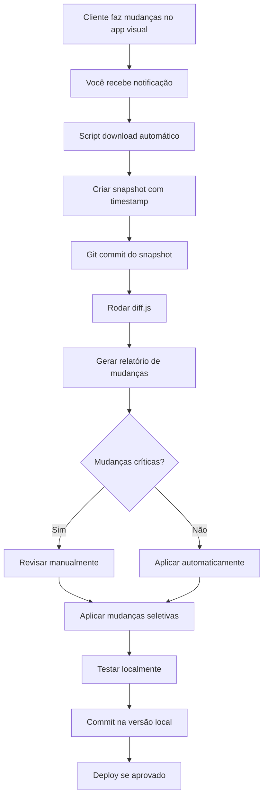

# 🔄 Estratégia de Migração e Sincronização - App Low-Code para React Local

## 📋 Sumário Executivo

Este documento detalha a estratégia completa para migrar um aplicativo desenvolvido em plataforma low-code/no-code (provavelmente FlutterFlow, Bubble, Adalo, ou similar) para uma versão React local organizada, mantendo sincronização com as mudanças do cliente.

---

## 🎯 Problema Identificado

### Situação Atual
- ✅ Cliente tem app funcional em plataforma visual (ex: FlutterFlow)
- ✅ Plataforma permite edição de frontend E Supabase
- ❌ Plataforma está gerando problemas
- ❌ Código exportado não tem versionamento Git
- ❌ Cliente continua fazendo mudanças no app original
- ❌ Baixar código sempre sobrescreve tudo localmente

### Desafios Principais
1. **Sem Git no criador visual** → Não há histórico de mudanças
2. **Export completo sempre** → Sobrescreve código local
3. **Identificar mudanças** → Difícil saber o que o cliente alterou
4. **Sincronização bidirecional** → Cliente edita lá, você edita aqui
5. **Migração de dados** → Supabase antigo → Supabase novo

---

## 🏗️ Arquitetura da Solução

```
┌─────────────────────────────────────────────────────────────┐
│                    CLIENTE (Plataforma Visual)              │
│  ┌─────────────────┐              ┌─────────────────┐      │
│  │   App Visual    │──────────────│  Supabase OLD   │      │
│  │  (FlutterFlow)  │              │ (dados cliente) │      │
│  └────────┬────────┘              └─────────────────┘      │
│           │                                                  │
│           │ Export código                                    │
│           ▼                                                  │
│  ┌─────────────────┐                                        │
│  │  exports/       │                                        │
│  │  app-export.zip │                                        │
│  └─────────────────┘                                        │
└─────────────────────────────────────────────────────────────┘
                      │
                      │ Download periódico
                      ▼
┌─────────────────────────────────────────────────────────────┐
│               SISTEMA DE SINCRONIZAÇÃO (Local)              │
│  ┌─────────────────┐              ┌─────────────────┐      │
│  │  sync-manager/  │──────────────│   Git Tracking  │      │
│  │  - download.js  │              │   - snapshots/  │      │
│  │  - diff.js      │              │   - diffs/      │      │
│  │  - analyze.js   │              │   - reports/    │      │
│  └─────────────────┘              └─────────────────┘      │
│           │                                                  │
│           │ Análise de mudanças                             │
│           ▼                                                  │
│  ┌─────────────────────────────────────────────┐           │
│  │         RELATÓRIO DE MUDANÇAS               │           │
│  │  • Componentes alterados                    │           │
│  │  • Funções modificadas                      │           │
│  │  • Schemas mudados                          │           │
│  │  • Sugestões de aplicação                   │           │
│  └─────────────────────────────────────────────┘           │
└─────────────────────────────────────────────────────────────┘
                      │
                      │ Aplicação manual/assistida
                      ▼
┌─────────────────────────────────────────────────────────────┐
│                  VERSÃO LOCAL ORGANIZADA                    │
│  ┌─────────────────┐              ┌─────────────────┐      │
│  │   React App     │──────────────│  Supabase NEW   │      │
│  │  (Vite + React) │              │ (organizado)    │      │
│  │   - Git ✓       │              │ - Migrations ✓  │      │
│  │   - Limpo ✓     │              │ - Backup ✓      │      │
│  └─────────────────┘              └─────────────────┘      │
└─────────────────────────────────────────────────────────────┘
```

---

## 🔧 Solução Completa - 5 Pilares

### 1️⃣ **Sistema de Versionamento de Snapshots**

**Objetivo:** Criar histórico Git dos exports mesmo sem Git na plataforma original

**Estrutura:**
```
/sync-manager/
├── snapshots/
│   ├── 2025-01-28_14-30/          ← Snapshot automático
│   │   ├── original/               ← Código exportado original
│   │   ├── diff-report.md          ← Relatório de diferenças
│   │   └── changes.json            ← Mudanças estruturadas
│   ├── 2025-01-28_18-45/
│   └── latest/                     ← Symlink para último
├── config/
│   └── sync-config.json            ← Configurações
├── scripts/
│   ├── download.js                 ← Download automático
│   ├── snapshot.js                 ← Criar snapshot
│   ├── diff.js                     ← Comparar snapshots
│   └── analyze.js                  ← Análise inteligente
└── README.md
```

**Como funciona:**
1. Script baixa export periodicamente (manual ou agendado)
2. Cria snapshot com timestamp no Git
3. Compara com snapshot anterior
4. Gera relatório detalhado de mudanças
5. Você decide o que aplicar no código local

---

### 2️⃣ **Sistema de Diff Inteligente**

**Não é diff simples de texto - é ANÁLISE SEMÂNTICA!**

**O que ele detecta:**

```typescript
// Exemplo de relatório gerado:

{
  "timestamp": "2025-01-28T14:30:00Z",
  "previousSnapshot": "2025-01-27_10-00",
  "changes": {
    "components": {
      "new": ["ProductCard.jsx", "CheckoutFlow.jsx"],
      "modified": ["Dashboard.jsx", "UserProfile.jsx"],
      "deleted": ["OldComponent.jsx"]
    },
    "database": {
      "tables": {
        "new": ["orders", "payments"],
        "modified": ["users", "products"],
        "columns_added": {
          "users": ["phone", "address"],
          "products": ["stock_quantity"]
        }
      },
      "functions": {
        "new": ["calculate_total", "process_payment"],
        "modified": ["get_user_orders"]
      }
    },
    "apis": {
      "new": ["/api/checkout", "/api/payments"],
      "modified": ["/api/users"]
    },
    "dependencies": {
      "added": ["stripe", "react-query"],
      "removed": ["old-payment-lib"]
    },
    "criticalChanges": [
      {
        "type": "breaking",
        "description": "Schema da tabela 'users' mudou - campo 'name' agora é obrigatório",
        "action": "Precisa migração de dados"
      }
    ]
  },
  "recommendations": [
    "Aplicar componentes ProductCard e CheckoutFlow primeiro",
    "Revisar mudanças em Dashboard.jsx antes de aplicar",
    "Criar migration para adicionar colunas em 'users'",
    "Testar integração com Stripe antes de deploy"
  ]
}
```

**Tecnologias usadas:**
- **AST Parsing** → Análise de código JavaScript/React
- **Schema Diff** → Comparação de schemas SQL
- **File Hashing** → Detectar arquivos idênticos
- **Dependency Analysis** → Mudanças em package.json

---

### 3️⃣ **Workflow de Sincronização**

**Processo Recomendado:**



**Comandos práticos:**

```bash
# 1. Cliente avisa que fez mudanças
# Você roda:
npm run sync:download

# 2. Sistema cria snapshot e gera diff
# Resultado: /sync-manager/snapshots/latest/diff-report.md

# 3. Você revisa o relatório:
cat sync-manager/snapshots/latest/diff-report.md

# 4. Aplica mudanças seletivamente:
npm run sync:apply --components ProductCard CheckoutFlow
npm run sync:apply --database users_table

# 5. Testa localmente:
npm run dev

# 6. Commit se tudo OK:
git add .
git commit -m "Sync: Added ProductCard, CheckoutFlow from client changes"
```

---

### 4️⃣ **Estratégia de Migração de Dados (Supabase OLD → NEW)**

**Desafio:** Migrar dados sem perder informações

**Solução em 3 fases:**

#### **Fase 1: Análise e Preparação**

```bash
# Script para analisar Supabase antigo
npm run analyze:supabase-old

# Gera:
# - Inventário de tabelas
# - Contagem de registros
# - Relacionamentos (foreign keys)
# - Políticas RLS
# - Funções SQL
# - Storage buckets
```

**Output esperado:**
```json
{
  "tables": {
    "users": { "rows": 1523, "size": "2.3 MB" },
    "products": { "rows": 456, "size": "890 KB" },
    "orders": { "rows": 3421, "size": "5.6 MB" }
  },
  "functions": ["calculate_total", "get_user_orders", "process_payment"],
  "storage": {
    "avatars": { "files": 1523, "size": "45 MB" },
    "products": { "files": 456, "size": "120 MB" }
  },
  "rls_policies": 34,
  "dependencies": {
    "users": ["orders", "reviews"],
    "products": ["orders", "reviews", "inventory"]
  }
}
```

#### **Fase 2: Criação do Schema Novo**

```bash
# 1. Gerar schema SQL do Supabase antigo
npm run export:schema-old

# 2. Limpar e organizar schema
npm run clean:schema

# 3. Criar migrations organizadas
npm run create:migrations

# Resultado:
# /Supabase/migrations/
# ├── 001_create_users_table.sql
# ├── 002_create_products_table.sql
# ├── 003_create_orders_table.sql
# ├── 004_create_functions.sql
# └── 005_create_rls_policies.sql
```

#### **Fase 3: Migração de Dados**

```bash
# Migração incremental (segura)
npm run migrate:data --table users --batch-size 100
npm run migrate:data --table products --batch-size 50
npm run migrate:data --table orders --batch-size 200

# Migração de storage
npm run migrate:storage --bucket avatars
npm run migrate:storage --bucket products

# Verificação
npm run verify:migration
```

**Script de migração com retry e validação:**
```typescript
// Pseudo-código
async function migrateTable(tableName, batchSize) {
  const oldSupabase = createOldClient()
  const newSupabase = createNewClient()

  let offset = 0
  let errors = []

  while (true) {
    // Buscar batch
    const { data, error } = await oldSupabase
      .from(tableName)
      .select('*')
      .range(offset, offset + batchSize - 1)

    if (data.length === 0) break

    // Inserir com retry
    for (const row of data) {
      let attempts = 0
      while (attempts < 3) {
        try {
          await newSupabase.from(tableName).insert(row)
          break
        } catch (err) {
          attempts++
          if (attempts === 3) errors.push({ table, row, error: err })
        }
      }
    }

    offset += batchSize
    console.log(`Migrated ${offset} rows from ${tableName}`)
  }

  // Salvar log de erros
  if (errors.length > 0) {
    fs.writeFileSync(`migration-errors-${tableName}.json`, JSON.stringify(errors))
  }
}
```

---

### 5️⃣ **Automação com Agente Especializado**

**Vou criar um agente Claude Code especializado em:**
- Analisar diffs automaticamente
- Sugerir quais mudanças aplicar
- Gerar código de migração
- Detectar breaking changes
- Criar PRs organizados

---

## 🛠️ Scripts Principais

### `sync-manager/scripts/download.js`
```javascript
// Download automático do export
// Suporta: URL direta, Google Drive, Dropbox, etc
```

### `sync-manager/scripts/snapshot.js`
```javascript
// Cria snapshot com timestamp
// Commita no Git automaticamente
```

### `sync-manager/scripts/diff.js`
```javascript
// Compara snapshots
// Gera relatório markdown + JSON
```

### `sync-manager/scripts/analyze.js`
```javascript
// Análise semântica profunda
// Recomendações de aplicação
```

### `sync-manager/scripts/apply.js`
```javascript
// Aplica mudanças seletivamente
// Merge inteligente com código local
```

---

## 📊 Estratégias de Sincronização

### Opção 1: **Manual Controlado** (Recomendado inicialmente)
```bash
# Cliente avisa → Você baixa → Revisa → Aplica
# Controle total, zero risco
```

**Prós:**
- ✅ Controle total
- ✅ Zero risco de quebrar
- ✅ Aprendizado do processo

**Contras:**
- ❌ Trabalho manual
- ❌ Demora mais

---

### Opção 2: **Semi-automático** (Recomendado após 2-3 semanas)
```bash
# Script roda diariamente → Gera diff → Notifica você
# Mudanças simples: auto-apply
# Mudanças complexas: revisão manual
```

**Prós:**
- ✅ Menos trabalho manual
- ✅ Ainda tem controle
- ✅ Rápido para mudanças simples

**Contras:**
- ❌ Precisa configurar regras

---

### Opção 3: **Automático com Validação** (Futuro, após estabilizar)
```bash
# Script roda → Auto-aplica → Roda testes → Notifica resultado
# Se testes passam: auto-commit
# Se testes falham: rollback + alerta
```

**Prós:**
- ✅ Mínimo esforço
- ✅ Sincronização contínua

**Contras:**
- ❌ Requer suite de testes robusta
- ❌ Setup inicial complexo

---

## 🎯 Recomendações Práticas

### Para o Cliente:
1. ✅ **Comunicar mudanças** → WhatsApp/Slack: "Fiz alteração X"
2. ✅ **Export periódico** → Toda sexta, fazer export e compartilhar
3. ✅ **Evitar mudanças no Supabase** → Só você mexe no banco novo
4. ✅ **Usar ambiente de teste** → Cliente testa no app dele, você valida local

### Para Você:
1. ✅ **Sync semanal mínimo** → Toda segunda, baixar e revisar mudanças
2. ✅ **Documentar tudo** → Cada sync, criar nota do que foi aplicado
3. ✅ **Testes antes de aplicar** → Sempre testar mudanças isoladamente
4. ✅ **Backup antes de sync** → Git branch para cada sync
5. ✅ **Comunicação clara** → Avisar cliente o que foi aplicado/rejeitado

---

## 🚀 Plano de Implementação

### Semana 1: Setup Inicial
- [ ] Criar estrutura `/sync-manager/`
- [ ] Configurar Git para snapshots
- [ ] Primeiro download e snapshot manual
- [ ] Criar Supabase novo
- [ ] Analisar schema antigo

### Semana 2: Migração Inicial
- [ ] Criar migrations do schema
- [ ] Migrar dados (tabelas principais)
- [ ] Migrar storage
- [ ] Verificar integridade
- [ ] Conectar app local ao Supabase novo

### Semana 3: Sistema de Diff
- [ ] Implementar scripts de diff
- [ ] Testar com 2-3 snapshots
- [ ] Refinar análise
- [ ] Documentar workflow

### Semana 4: Automação
- [ ] Script de download automático
- [ ] Notificações
- [ ] Aplicação assistida de mudanças
- [ ] Testes de integração

---

## ⚠️ Riscos e Mitigações

| Risco | Probabilidade | Impacto | Mitigação |
|-------|--------------|---------|-----------|
| Cliente quebra algo no Supabase antigo | Alta | Alto | Backup diário automático |
| Mudanças incompatíveis com código local | Média | Alto | Diff detalhado + revisão manual |
| Perda de dados na migração | Baixa | Crítico | Migração incremental + validação |
| Conflitos de sincronização | Alta | Médio | Snapshots Git + rollback fácil |
| Cliente não comunica mudanças | Média | Médio | Sync automático semanal |

---

## 📈 Métricas de Sucesso

Após 1 mês, você deve ter:
- ✅ App local rodando 100% funcional
- ✅ Supabase novo com dados migrados
- ✅ Sistema de sync funcionando
- ✅ Histórico de 4+ snapshots no Git
- ✅ Tempo de sync < 2 horas/semana
- ✅ Zero perda de dados
- ✅ Cliente satisfeito com processo

---

## 🔄 Próximos Passos

**Agora vou criar:**
1. ✅ Scripts completos de sync
2. ✅ Agente especializado em migração
3. ✅ Documentação detalhada de cada script
4. ✅ Exemplos práticos de uso

**O que você precisa me fornecer:**
- 📁 Nome da plataforma que o cliente usa (FlutterFlow, Bubble, etc?)
- 📁 Como é feito o export atualmente? (ZIP, Git, Google Drive?)
- 📁 Com que frequência o cliente faz mudanças? (diário, semanal?)
- 📁 Quantas tabelas tem no Supabase antigo aproximadamente?

---

**Preparado para começar a implementação?** 🚀
